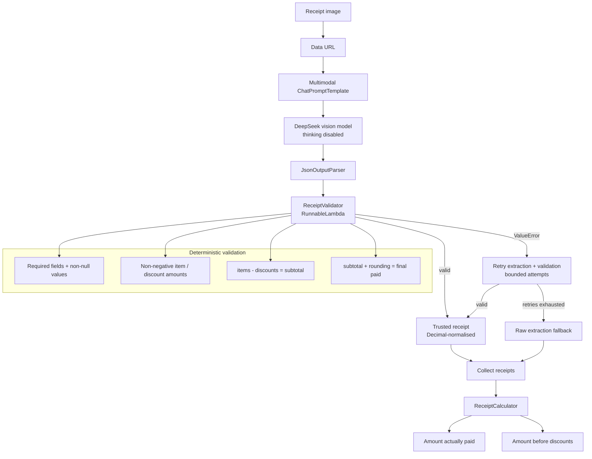

# Receipt Agent

> **Provenance / attribution:** This repository is a standalone adaptation of my submitted fork of **CUHK FTEC5660 Homework 1**: https://github.com/alistairkung/FTEC5660. The original assignment scaffold, task framing, and `public_test` fixtures came from the course materials. This repository is a **post-submission refactor and extension for learning**, not an attempt to present the original homework scaffold as my own work.

A small multimodal receipt-processing agent built around one idea that became much clearer to me while doing the homework:

> AI can make implementation dramatically faster, but reliable software still depends on deciding what the model should be trusted to do, what should remain deterministic, and how the system should react when the model is wrong.

The original assignment asked for two aggregate answers from a folder of supermarket receipts:

1. How much money was actually paid?
2. How much would the receipts have cost without discounts?

This version keeps that core problem, but removes the homework-specific runner/interface and turns the solution into a standalone receipt pipeline.

## Why I kept working on it

During the homework, the easy part increasingly became writing code to a clear specification. AI was very good at generating repetitive validators, fixtures, and plumbing once the desired behaviour was understood.

The harder and more interesting decisions were architectural:

- Should the LLM calculate the final totals, or only extract receipt facts?
- How do I know whether a visually plausible JSON response is actually trustworthy?
- What happens when the model reads a unit price instead of a quantity-extended line total?
- Should a bad extraction crash the whole batch?
- When is retry justified rather than just adding complexity?

Those questions drove the final design more than the amount of code did.

## Architecture



The key boundary is:

```text
LLM
visual interpretation / transcription
        ↓
deterministic Python
validation / reconciliation / arithmetic
```

## Design decisions that came from real failures

### 1. The LLM extracts; Python calculates

The first instinct could easily be to ask the model to inspect all receipts and answer the two questions directly.

Instead, each image is converted into a structured receipt contract containing:

- original item line amounts;
- discounts as positive magnitudes;
- subtotal after discounts;
- signed rounding;
- final amount paid.

The final arithmetic is then done deterministically in Python.

This makes the model responsible for the task it is useful for — interpreting messy visual input — without also trusting it with arithmetic that ordinary code can do exactly.

### 2. Redundant receipt fields are useful

The calculator technically only needs:

- `amount_paid_after_rounding` for the amount actually spent; and
- `original_line_amount` values for the no-discount total.

The extraction still includes discounts, subtotal, and rounding because they give the validator independent consistency checks:

```text
sum(items) - sum(discounts) = subtotal_after_discounts

subtotal_after_discounts + rounding = amount_paid_after_rounding
```

A response can therefore be valid JSON and still be rejected as an inconsistent receipt extraction.

### 3. Currency is normalised to Decimal

Model JSON arrives with ordinary numeric values. The validation boundary converts known monetary fields to `Decimal` before deterministic arithmetic.

This avoids binary floating-point surprises in currency sums while keeping the model-facing schema simple.

### 4. Quantity handling needed an explicit prompt rule

During evaluation, the vision model sometimes read a per-unit price instead of the extended line total for quantity > 1.

The prompt now explicitly states that `original_line_amount` must represent the total pre-discount amount for the whole purchased quantity and must not be divided back into a unit price.

### 5. Thinking mode was the wrong tool for extraction

With DeepSeek thinking enabled, the model could spend thousands of tokens repeatedly reasoning through receipt arithmetic and still fail to emit final JSON.

For this pipeline, thinking is disabled. The model is asked to interpret and transcribe; deterministic code handles reconciliation and calculation.

### 6. Retry is triggered by deterministic evidence

Validation is composed into the LCEL chain with `RunnableLambda`, and the combined extraction + validation chain uses `.with_retry(...)`.

That means a validation failure causes the **whole extraction to run again** rather than simply re-validating the same bad dictionary.

This was justified by observed model variability: repeated calls on the same receipt could produce different OCR or quantity interpretations.

### 7. A batch should degrade gracefully

A repeated validation failure does not automatically mean the entire folder should fail.

After bounded validated retries are exhausted, the pipeline falls back to one raw extraction for that receipt and continues processing the remaining images.

That is a deliberate availability trade-off:

```text
validated answer if possible
        ↓
best-effort answer if necessary
        ↓
do not lose the whole batch because one receipt is stubborn
```

The result records which files needed that fallback.

## Command-line usage

Python module names cannot contain hyphens, so the standalone equivalent of a command such as `python -m receipts-agent.py ...` is:

```bash
python -m receipt_agent <folder>
```

For example:

```bash
python -m receipt_agent public_test
```

Optional retry count:

```bash
python -m receipt_agent public_test --attempts 5
```

The command prints per-receipt validation status followed by aggregate totals:

```text
Processed 7 receipt(s)
Amount paid: HK$1974.30
Without discounts: HK$2348.20
```

If any receipt exhausts validated retries, the output also identifies the files that used the raw fallback.

## Setup

```bash
python3 -m venv .venv
source .venv/bin/activate
pip install -r requirements.txt
```

Create a `.env` file:

```text
DEEPSEEK_API_KEY=...
```

Then run:

```bash
python -m receipt_agent public_test
```

The vision model currently used is:

```text
deepseek-v4-flash-vision-exp
```

## Tests

Run the complete deterministic suite with:

```bash
python -m pytest
```

The tests do not require live DeepSeek calls.

They cover:

- **extractor contract** — multimodal prompt/image wiring and JSON parsing using a fake runnable model;
- **validator behaviour** — required fields, nulls, sign boundaries, zero-value marker lines, `Decimal` normalisation, and arithmetic reconciliation;
- **calculator behaviour** — known receipt fixtures and aggregate totals;
- **pipeline behaviour** — successful validated processing and graceful raw fallback after validation failure.

## Project structure

```text
receipt_agent/
├── __init__.py
├── __main__.py        # python -m receipt_agent ...
└── pipeline.py        # integration, retry, fallback, aggregation

lib/
├── receipt_extractor.py
├── receipt_validator.py
└── receipt_calculator.py

test/
├── test_receipt_extractor.py
├── test_receipt_validator.py
├── test_receipt_calculator.py
└── test_receipt_pipeline.py
```

The modules remain deliberately small:

- `receipt_extractor.py` owns the multimodal prompt and LCEL extraction chain.
- `receipt_validator.py` defines the trust boundary between probabilistic model output and deterministic code.
- `receipt_calculator.py` performs exact aggregate arithmetic.
- `receipt_agent/pipeline.py` composes them into the runtime system.

## What this project changed my mind about

Working through this made the “AI replaces software engineers” question feel less binary.

AI made some implementation work almost trivial. Once I knew exactly what I wanted, repetitive code was much faster to produce. But the difficult parts were still deciding the contract, identifying failure modes, allocating responsibility between the model and deterministic code, and designing a system that stayed useful when the model behaved unpredictably.

That makes me think the near-term shift is less about software engineering disappearing and more about engineering moving upward: less time spent typing straightforward implementation details, more time specifying behaviour, building constraints, evaluating uncertain components, and deciding what should happen when those components fail.
